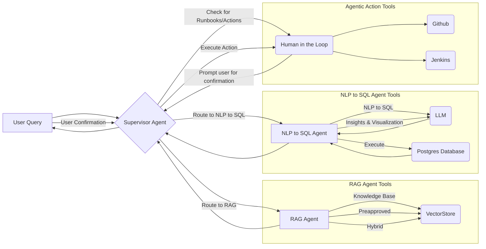

# rag-multiagent-architecture
# Multi-Agentic Workflow with Langchain LangGraph

### DESCRIPTION

This application is a powerful Q&A chatbot designed to provide comprehensive support for the Global Batch Platform (GBP). Built with a robust AI agentic workflow leveraging the REACT framework and the advanced capabilities of the Gemini LLM, this chatbot offers a seamless and intuitive way to access information and perform analytical tasks related to GBP.

### Key Components

1.  **Supervisor Agent:**
    * Acts as the central entry point for all user questions.
    * Intelligently analyzes incoming queries to determine their nature (e.g., informational or analytical).
    * Routes queries to the most appropriate downstream agent based on the analysis.

2.  **Child Agents:**
    * **RAG Agentic AI:**
        * Specialized in Retrieval-Augmented Generation (RAG).
        * Equipped with tools to retrieve relevant information from Confluence and Jira documents stored in the vector database.
        * Generates comprehensive and context-aware responses based on the retrieved information.
        * Provides references to the specific sources used to generate the response.
    * **NLP to SQL Agent:**
        * Capable of understanding natural language queries and converting them into valid PostgreSQL SQL queries.
        * Executes the generated SQL queries against the PostgreSQL database.
        * Analyzes the retrieved data to produce insightful statistical and analytical summaries.
        * Offers recommendations on suitable visualizations that can be created from the query results or the underlying data.

### Key Features

* **Agentic Development Framework:** The Agentic AI development framework implemented in this project allows users to easily build, plug and play new AI agents with minimal code and/or prompt updates.
* **Feedback Loop:** Incorporates mechanisms for continuous improvement by allowing feedback on agent performance and incorporating it into future decision-making.
* **Human in the Loop:** Enables human intervention and oversight at critical stages, allowing for review, correction, or guidance of the agent's actions.
* **Thread and Session Management:** Maintains context across multiple turns of conversation, allowing for more coherent and natural interactions.
* **Reference to Sources:** The RAG agent explicitly cites the sources from Confluence and Jira that contributed to its responses, enhancing transparency and trust.
* **Reflection:** Implements a reflection mechanism allowing agents to evaluate their own reasoning and outputs, leading to more robust and accurate results.

### Architecture

The system's architecture is designed to efficiently route user queries to the specialized agents best equipped to handle them:

1.  **User Query:** The user initiates a request.
2.  **Supervisor Agent:**
    * The Supervisor Agent analyzes the user's query to determine its nature (e.g., informational or analytical).
    * Based on this analysis, it routes the query to the most appropriate child agent:
        * **RAG Agent:** For general knowledge retrieval, troubleshooting, and how-to questions.
        * **NLP to SQL Agent:** For analytical queries requiring database interaction and data analysis.
3.  **Child Agents and Tools:**

    * **RAG Agent:**
        * The RAG Agent uses the Vectorstore to retrieve information from internal documentation to provide comprehensive responses. Its tools include:
            * Knowledge Base Tool
            * Pre-approved Response Tool
            * Hybrid Response Tool
    * **NLP to SQL Agent:**
        * The NLP to SQL Agent focuses on data-driven tasks using the following tools:
            * Generate SQL Query from NLP: Translates natural language queries into executable SQL.
            * Generate Data Insights & Visualization Recommendations: Analyzes query results and suggests appropriate visualizations.
4.  **Data Interaction:**
    * The system interacts with data sources like the Vectorstore (for RAG Agent) and the PostgreSQL Database (for NLP to SQL Agent).
5.  **User Response and Feedback:**
    * The system provides a response to the user.
    * It also supports a human-in-the-loop process for agentic actions requiring user confirmation or authorization.

