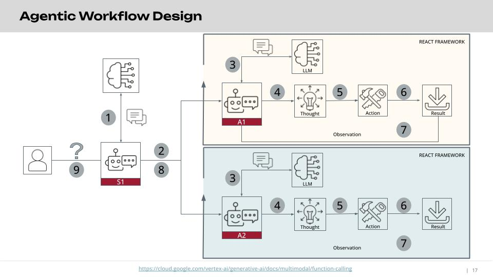
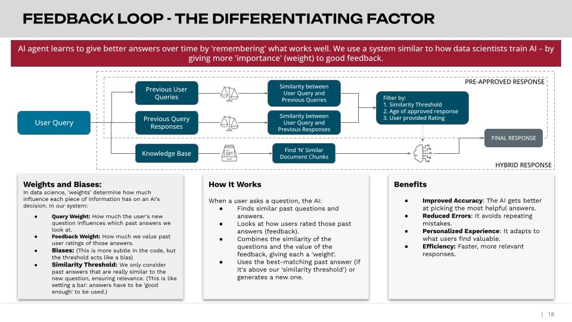

# rag-multiagent-architecture
# Multi-Agentic Workflow with Langchain LangGraph

This repository contains a multi-agentic workflow built using Langchain LangGraph, designed to intelligently handle user queries by routing them to specialized agents. The application leverages Confluence and Jira HTML documents for information retrieval and PostgreSQL with pgvector for efficient vector storage.

## Key Components

1.  **Supervisor Agent:**
    * Acts as the central entry point for all user questions.
    * Intelligently routes incoming queries to the most appropriate downstream agent based on the nature of the request.

2.  **Child Agents:**
    * **RAG Agentic AI:**
        * Specialized in Retrieval-Augmented Generation (RAG).
        * Equipped with the following tools (defined in `tools.py`)
        * Retrieves relevant information from Confluence and Jira documents stored in the vector database.
        * Generates comprehensive and context-aware responses based on the retrieved information.
        * Provides references to the specific sources used to generate the response.
    * **NLP to SQL Agent:**
        * Capable of understanding natural language queries and converting them into valid PostgreSQL SQL queries.
        * Executes the generated SQL queries against the PostgreSQL database.
        * Analyzes the retrieved data to produce insightful statistical and analytical summaries.
        * Offers recommendations on suitable visualizations that can be created from the query results or the underlying data.

## Key Features

* **Feedback Loop:** Incorporates mechanisms for continuous improvement by allowing feedback on agent performance and incorporating it into future decision-making.
* **Human in the Loop:** Enables human intervention and oversight at critical stages, allowing for review, correction, or guidance of the agent's actions.
* **Thread and Session Management:** Maintains context across multiple turns of conversation, allowing for more coherent and natural interactions.
* **Reference to Sources:** The RAG agent explicitly cites the sources from Confluence and Jira that contributed to its responses, enhancing transparency and trust.
* **Reflection:** Implements a reflection mechanism allowing agents to evaluate their own reasoning and outputs, leading to more robust and accurate results.

## Architecture

```mermaid
graph LR
    A[User Query] --> B(Supervisor Agent);
    B -- Route to RAG --> C(RAG Agentic AI);
    B -- Route to NLP to SQL --> D(NLP to SQL Agent);
    C -- Uses Tools --> E{Confluence & Jira (Vectorstore)};
    D -- Converts to SQL --> F(PostgreSQL Database);
    F -- Executes Query --> D;
    C -- Generates Response with Sources --> G[User Response (with References)];
    D -- Analyzes Data & Recommends Visualizations --> H[User Response (Summary & Visualizations)];
    G --> A;
    H --> A;
    subgraph Data Sources
        E
        F
    end

